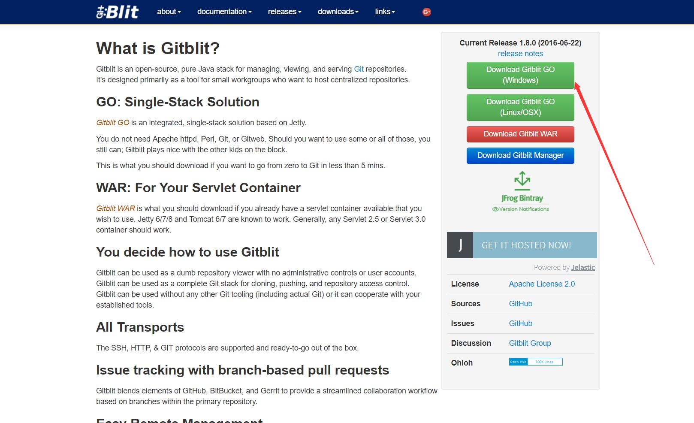

:::tip
windows server 使用 gitblit 1.8.0 搭建 git 仓库，使用 git hooks 实现简单一键式部署
:::

<!-- more -->

### 1.准备资源

- 一台 windows server 服务器
- blog 网站源码 （本次搭建使用的是 vuepress,稍后会在下一篇中介绍使用）

### 2.登录服务器

- 下载[gitblit](http://www.gitblit.org/)
  

### 3.下载 java7

- 下载[java7](https://www.oracle.com/technetwork/java/javase/downloads/java-archive-downloads-javase7-521261.html)

### 4.解压后修改配置

- 进入 gitblit\data 找到 defaults.properties 配置文件，修改如下参数，然后保存

```
#git仓库目录
git.repositoriesFolder = D:\GitSpace
#git服务器http端口
server.httpPort = 1010
#git服务器https端口，如果8443端口被占用就改成其他的
server.httpsPort = 8443
#服务器http IP
server.httpBindInterface = xxx.xxx.xxx
#服务器https IP
server.httpsBindInterface = localhost
#服务暂停端口，如果8081被占用，改成其他的
server.shutdownPort = 8081

```

### 5.管理员身份运行 gitblit.cmd
